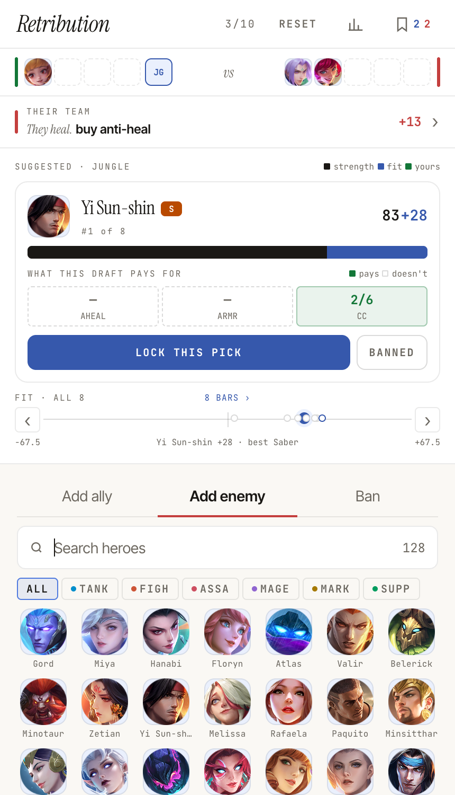
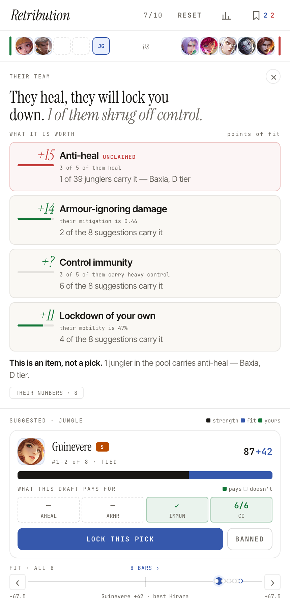
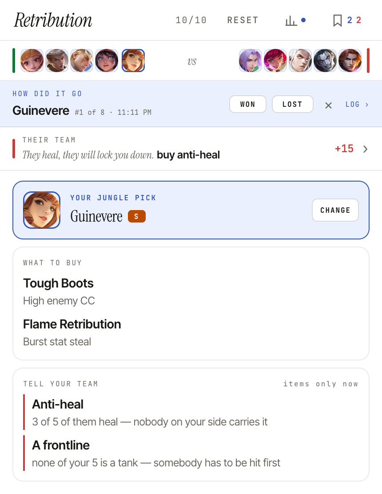
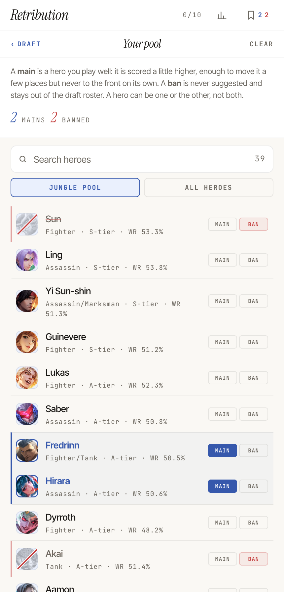

# Retribution

> A jungler pick assistant for Mobile Legends: Bang Bang, built to be measured rather than believed

You have about thirty seconds to pick a jungler against a half-revealed enemy team.
Retribution scores the 39 jungle heroes against whatever is on the board, says what
this particular draft is paying for, and shows its working.

The interesting part is not the recommendation. It is that the recommendation is
checked against 74 professional drafts on every commit, and that most of the work so
far has been finding out that earlier versions were wrong.

<div align="center">
  
  <br />
  <sub><em>Two enemies in, one ally down&nbsp;&nbsp;·&nbsp;&nbsp;Yi Sun-shin at 83 strength and +28 fit&nbsp;&nbsp;·&nbsp;&nbsp;the axis says Saber answers this draft better</em></sub>
</div>

## How good is it, actually

The first version of the scoring formula performed at the level of random choice.
Sorting by `hero.score` alone — the raw meta ranking from the data source, no logic
at all — did more than twice as well.

That is measurable because the benchmark exists: 74 pro games with pick and ban order,
scraped from Liquipedia. For each game the engine is asked to pick a jungler given the
enemy team, and scored on whether the hero the pros actually took lands in its top 8.

```
                    recall@8    median rank
before                 25%           16
now                    52%            8
```

Partial reveals matter more than the full picture, because that is when you actually
pick. With one to four enemies revealed the engine lands 53–56%.

**The benchmark is a regression guard, not a target.** We measured what it is
actually sensitive to: the total variation distance between enemy-composition splits
is only 22%, 18 of 39 junglers ever appear, and the top five cover 67% of picks. It is
roughly 80% a measure of meta strength and nearly blind to the situational half.
Optimising against it directly would converge on "show the tier list". So it is paired
with an invariant suite — properties that must hold regardless of what the benchmark
says, like "adding an enemy that counters this hero must never raise its score".

## What it does

**Scores the draft as it fills in.** Enemies, allies and heroes banned in the match
all change the answer. The score splits into three readings you can see separately:
how strong the hero is on its own, how well it answers this draft, and what it is
worth to you personally.

**Says what the draft is paying for.** Not "Baxia 87%" but "3 of 5 of them heal,
anti-heal is worth +18 here, nothing in your list carries it — this is an item, not a
pick". Every number on screen comes from the same constants the score does, so the
explanation cannot drift from the calculation.

<div align="center">
  
  <br />
  <sub><em>What their draft is worth, rule by rule&nbsp;&nbsp;·&nbsp;&nbsp;a rule nothing can price yet reads <code>+?</code> rather than zero</em></sub>
</div>

**Prices what the enemy can still do to you.** While they hold open slots, a hero
whose counters are all still available is a riskier pick than one whose counters are
gone. Mark the heroes banned in the match and the risk drops accordingly.

**Keeps reading the pick after you lock it.** The engine stops scoring a hero the
moment it is on the board, so the locked view carries a number of its own: a matchup
index against the enemy team, the movement since you locked, and the heroes behind it
named — taken against you with how hard they hit, ones you beat, ones you work with,
and the counters they can still take. It is deliberately not the engine's situational
score: that score moves when *any* hero appears, so a harmless reveal would read as
the draft turning. This one moves only when a hero the data actually prices as a
matchup lands on their side. You can also mark your hero before a single enemy is
revealed — tap the empty JG slot — which is the case the suggestion list cannot serve,
since there are no suggestions on a blank board.

**Answers what to buy.** Once a pick is locked: boots and Retribution blessing against
this enemy composition.

**Tells you what to say to your team.** With picks still to come, what your side is
still missing, phrased to be said out loud — "Lockdown: their mobility is 71%, nothing
on your side holds anyone still."

<div align="center">
  
  <br />
  <sub><em>Board full, pick locked&nbsp;&nbsp;·&nbsp;&nbsp;boots and blessing for this enemy team&nbsp;&nbsp;·&nbsp;&nbsp;with no picks left, the gaps are items now</em></sub>
</div>

**Remembers your pool.** Heroes you main are scored a little higher — enough to move
one a few places, never to the front on its own. Heroes you never want are never
suggested.

<div align="center">
  
  <br />
  <sub><em>One list, two opposite marks&nbsp;&nbsp;·&nbsp;&nbsp;a hero can be one or the other, never both</em></sub>
</div>

**Keeps a log.** Every locked pick is written down with the whole draft and everything
the engine said about it, including where your pick ranked and whether you took the
top one. A pick marked before any suggestions existed is logged as blind and counted
apart from both — the engine never advised on it, so counting it as disagreement would
misreport the engine — and a hero taken from the roster while a list was up but below
it counts as an override. Mark won or lost afterwards, add a note, export it as JSON
for an agent to read. This is the only feedback loop that measures *you* rather than
the meta.

## The data

Two sources, merged, because neither is right on its own.

**mlbb.io** gives tiers, win/pick/ban rates by rank, and counter/synergy relations. It
does not always know which heroes are junglers — Akai is filed as a roamer despite
twenty pro jungle games.

**Liquipedia** gives the actual skill text for all 133 heroes, from which capabilities
are derived: crowd control weight, mobility, sustain, anti-heal, control immunity,
shields, damage that ignores armour, base stats. A golden fixture pins the result so a
parser change cannot quietly reclassify the roster.

Getting this right mattered more than any formula change. Some things the parse
originally got wrong, and how:

- `vamp=50` on a skill is the spell-vamp ratio that skill applies, a global game rule
  present on 122 skills — not built-in lifesteal. Reading it as sustain marked 103 of
  133 heroes as self-sustaining.
- A proximity regex using `[^.]` will not cross a decimal point, so "recovers 1.5% Max
  HP" never matched and Thamuz lost his self-heal.
- Tightening a knockback pattern too far dropped "knocking them back" and "knocks them
  airborne", taking Chou from 5 crowd control to 2.

## Scoring

Thirteen components. The foundation is the hero on its own — tier, win rate weighted
by pick-rate reliability, meta signal. Everything situational is summed and then
squashed through `tanh` into a fixed budget, so the draft can move a pick meaningfully
without ever overwhelming what the hero is.

```
total = base + meta  +  budget · tanh(situational / reference)  +  comfort
        └─ strength ─┘  └──────────── fit ────────────────────┘  └ yours ┘
```

The situational half: team balance, damage type balance, enemy vulnerability, strong
against, crowd control chain synergy, invade resistance, counter penalty, counter
threat, synergy, early/late game tempo.

Two properties worth naming, both learned the hard way:

**A hard clamp broke monotonicity.** A hero already at the budget ceiling gained
nothing from a better matchup, which three invariants caught. `tanh` is bounded and
monotonic, so it keeps the ceiling without the flat spot.

**The budget is the best possible foundation at that rank, not the hero's own.** When
it was proportional to each hero's own foundation, a D-tier could move ±1.5 points
while an A-tier moved ±31, which froze weak heroes in place regardless of the draft.

Weights are tuned per rank, Epic through Mythical Glory+.

## Running it

```fish
git clone https://github.com/pkarpovich/retribution.git
cd retribution
pnpm install
pnpm dev
```

Then http://localhost:50200. The toolchain is pinned in `mise.toml` — Node 24.18.0
and pnpm 11.17.0 — and `packageManager` in `package.json` holds CI to the same pnpm,
so a machine with mise needs nothing else.

```fish
pnpm test      # 361 tests: engine, invariants, benchmark, components
pnpm check     # svelte-check
pnpm lint
pnpm build
```

Tests run as two Vitest projects. The engine suite runs in node; component tests get a
jsdom project of their own, so the pro-draft benchmark does not pay for a DOM it never
touches.

## Refreshing the data

```fish
node scripts/fetch-heroes.js --allow-partial   # mlbb.io, merged with Liquipedia
node scripts/fetch-liquipedia-skills.js        # skills, ~2s between requests
node scripts/fetch-pro-drafts.js               # the benchmark corpus
```

Hero data refreshes twice a week (Mon/Thu) through Gitea Actions, which runs the full
suite before committing — the golden fixture and the benchmark are what stop a bad
refresh reaching master.

Liquipedia answers 406 without `Accept-Encoding: gzip`, and rate-limits at 2 seconds
between parses, 30 between queries.

## Built with

Svelte 5 with runes, TypeScript, Vite 8 on Rolldown, vite-plugin-pwa for offline. No UI
framework and no state library: two localStorage-backed rune stores, the draft in
component state, everything else derived.

The CSS leans on what browsers can do now — container queries so the layout responds to
the panel it is in rather than the window, OKLCH throughout, `color-mix`, cascade
layers, logical properties. Light only, on purpose.

## Credits

Hero data from [mlbb.io](https://mlbb.io). Skills and pro drafts from
[Liquipedia](https://liquipedia.net/mobilelegends), CC-BY-SA 3.0.
